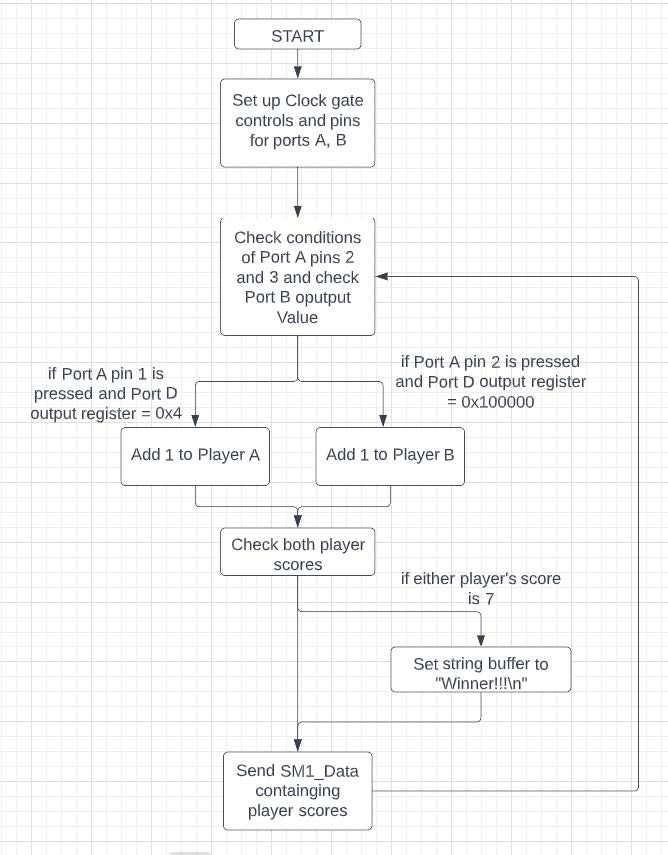
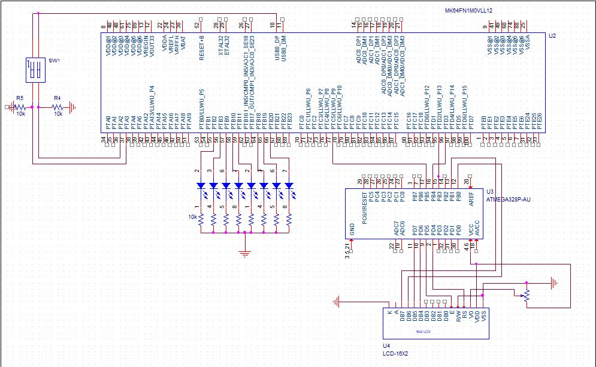

# LED-Game Embedded School Project

## Game using K64F and Arduino
Demo link: https://youtube.com/shorts/7cjX4Qw4ruc?feature=share 

## Project Description:

This project is a game using LEDs and buttons. The LED’s light up in a sequence so that they “bounce” back and forth along a line of LED’s. At each line of LED’s there is a red colored LED. This is the LED that each player respectively is trying to press their button when it is lit up. If a player successfully presses the button when their red LED is illuminated they will gain a point that is displayed on the LCD screen. The first player to 7 points wins and the game restarts. 
The technical goals for the project are to use the K64F to light the LEDs in a back and forth motion. The K64F will also read when either of the two buttons are pressed. The K64F will then check if a button is press happened at the correct time and then increment the corresponding players score. The players scores are then send via UART communication from the K64F to the Arduino. The Arduino reads in the data from the UART communication and then updates the LCD display. The Arduino also continuously plays music. 

## System Design:  

## Implementation Details:

## Testing/Evaluation:
Testing hardware was done at home because I have a multimeter, oscilloscope, and power supply. The only thing of the three really used was the multimeter to determine the values of resistor.  
The parts required were the K64F development board, Arudino Uno, 16x2 LCD, 10k potentiometer, two buttons, 8 LED’s, a buzzer, and 10 resistors of various values. 
Most of the hardware components went together without issue. The testing happened mainly in Kinetics Design Studio. Testing scenarios were to implement one feature at a time and thoroughly test before adding any new features.

## Challenges:
One of the challenges faced was with finding pins on each port to support each feature. I initially had the LED’s on port D, but later had to move them to port B because I need port D pins for the UART communication. 
I believe that time was the largest limitation I had with this project. There could have been better features such as a much larger arrangement of LED’s so that more players can play at the same time. An improvement in the development process would be to start with designing the wiring and pinout locations of the entire project first before any development begins.
